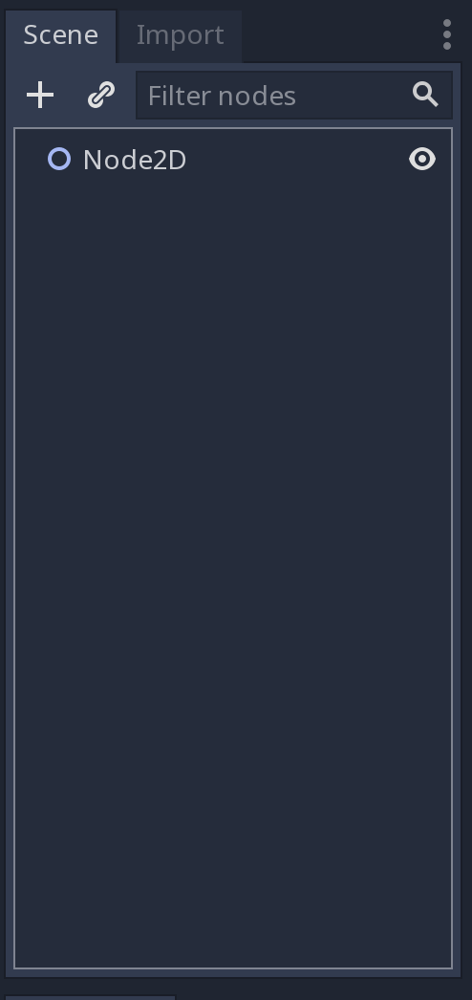
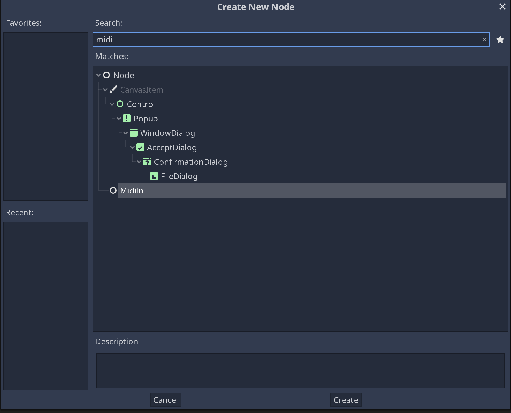
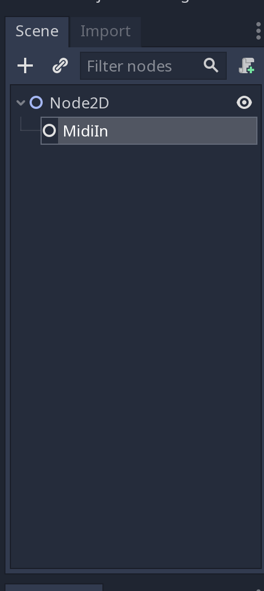
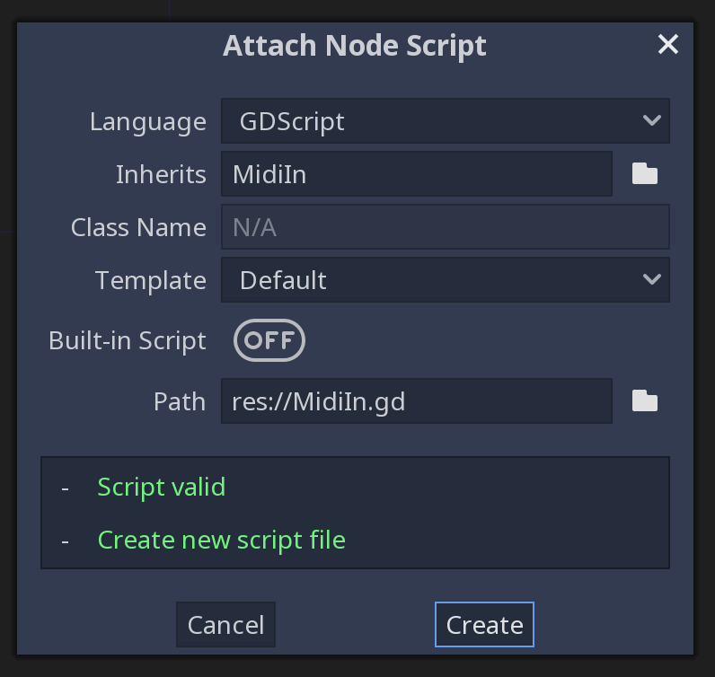
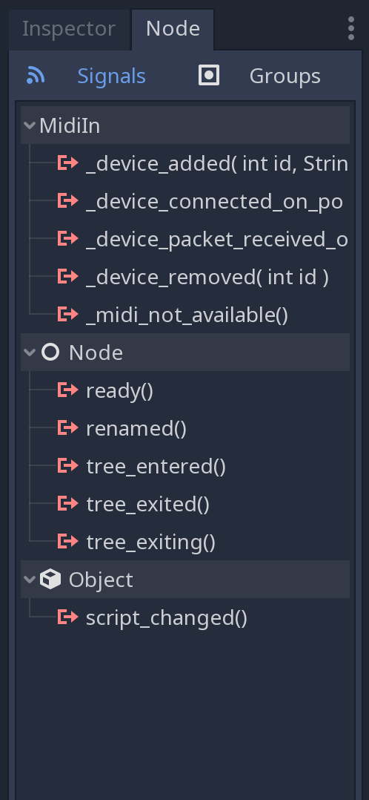
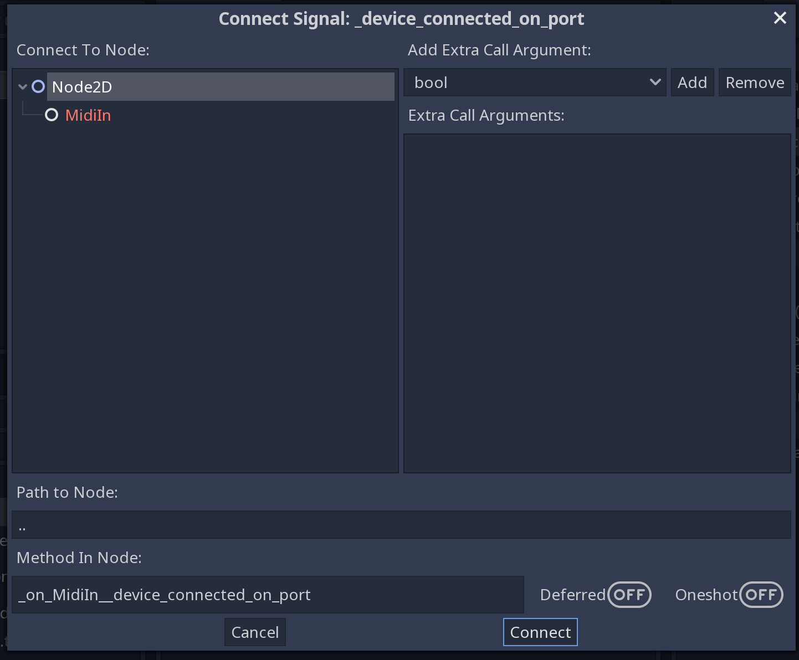
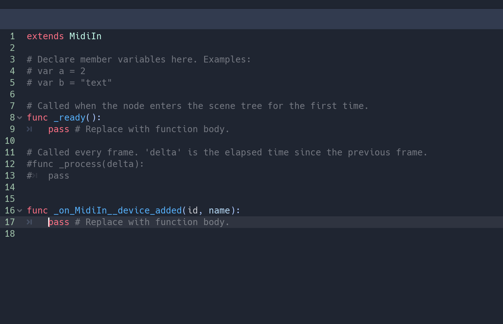

# CURRENTLY ONLY WORKS WITH GODOT VERSION >=3.1

# A [GODOT Engine](https://github.com/godotengine/godot) MIDI In Module for Android & iOS
## (+ MacOS for testing)

This GODOT module is primarliy for iOS and Android devices to make it easier to listen on midi in signals from your smartphone.

For every midi device you connect to the device you will get the callbacks you need to read the midi device data on a specific port.

### TODO
* Test on iOS
* Android Bluetooth support?

## Example project

    ./example


## How to


1. Compile Godot with ```./midiIn``` in the godot ```module``` dir.

	- Read up on how to compile modules for Android here http://docs.godotengine.org/en/3.0/development/compiling/compiling_for_android.html
	

1. Open GODOT

1. Create new, or open a project.

1. For Android: Add these lines to your ```project.godot``` file

    	[android]
    	modules="org/godotengine/godot/GodotMidiIn"

1. Follow the step by step guide below.

### Step by step

1. Add new Node



2. Select the MidiIn Node and press Create



3. Now you should have your Node as a child to the parent Node.



4. (Optional) Attach script to the new MidiIn node



5. If you click on your Node tab you can see all available signals you can listen to.



6. (Optional) Double click on a signal to connect it to a method in your Node.

 <br />
